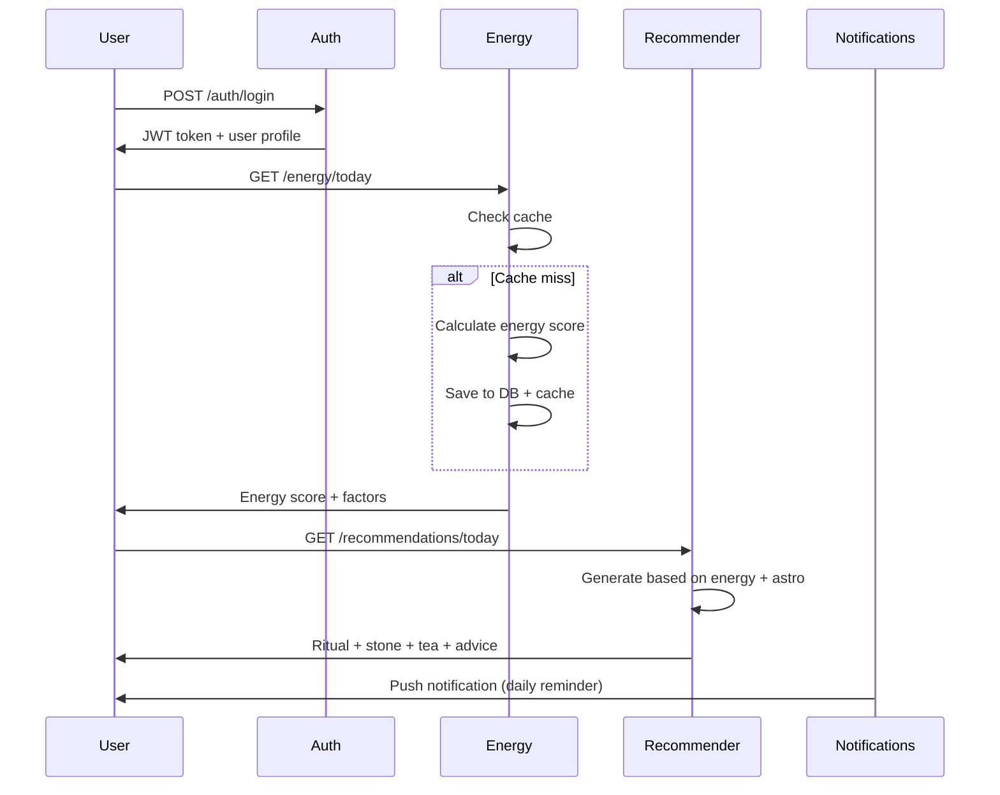
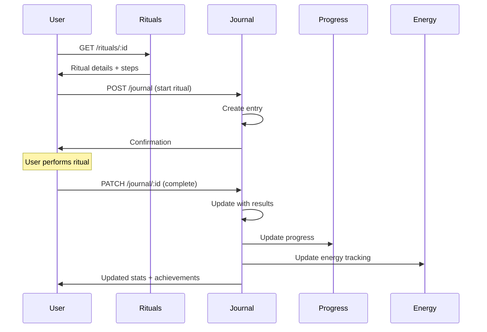
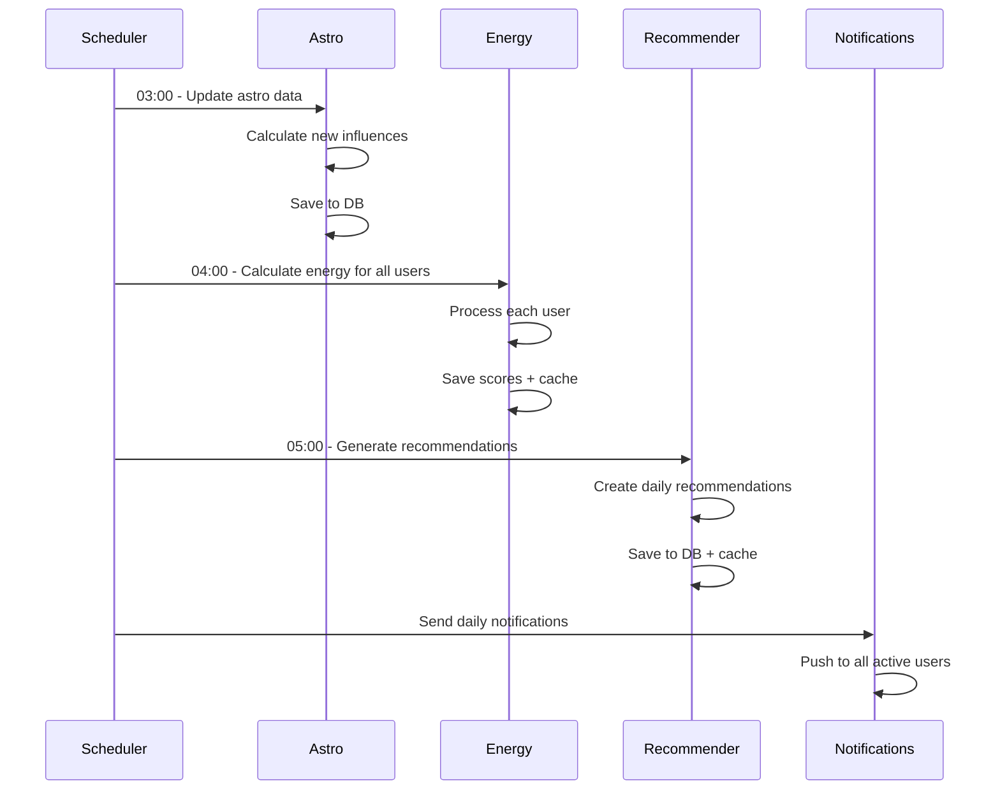

# 🔮 Mystical Astro Server - Подробная документация

## 📋 Содержание
1. [Обзор системы](#обзор-системы)
2. [Архитектура и модули](#архитектура-и-модули)
3. [Логика работы приложения](#логика-работы-приложения)
4. [API Endpoints и их использование](#api-endpoints-и-их-использование)
5. [Последовательность вызовов](#последовательность-вызовов)
6. [Автоматические задачи](#автоматические-задачи)
7. [Интеграции и зависимости](#интеграции-и-зависимости)
8. [Примеры использования](#примеры-использования)

## 🎯 Обзор системы

**Mystical Astro Server** - это астрологический сервис, который предоставляет персональные рекомендации на основе:
- Астрологических данных (лунные фазы, знаки зодиака)
- Энергетических показателей пользователя
- Персональных предпочтений и истории
- Времени года и дня недели

### Основные возможности:
- 📊 Расчет энергетического показателя дня
- 🌙 Астрологические рекомендации
- 🧘‍♀️ Персональные ритуалы
- 💎 Камни дня
- 🍵 Рецепты настоев
- 📝 Дневник прогресса
- 🔔 Уведомления и напоминания

## 🏗️ Архитектура и модули

### Структура модулей:
```
src/
├── common/                    # Общие сервисы
│   ├── database/            # Prisma + PostgreSQL
│   ├── redis/               # Кэширование
│   ├── rabbitmq/            # Очереди сообщений
│   ├── email/               # Email сервис
│   ├── storage/             # Файловое хранилище
│   └── i18n/                # Интернационализация
├── modules/                  # Основные модули
│   ├── auth/                # Аутентификация
│   ├── users/               # Управление пользователями
│   ├── astro/               # Астрологические расчеты
│   ├── energy-engine/       # Энергетический движок
│   ├── recommender/         # Система рекомендаций
│   ├── rituals/             # Управление ритуалами
│   ├── journal/             # Дневник пользователя
│   ├── progress/            # Отслеживание прогресса
│   ├── subscriptions/       # Подписки
│   ├── notifications/       # Уведомления
│   ├── analytics/           # Аналитика
│   └── content/             # Контент (ритуалы, камни, рецепты)
└── health/                  # Мониторинг здоровья системы
```

## 🔄 Логика работы приложения

### 1. Жизненный цикл приложения

#### Запуск (startup):
1. **Инициализация модулей** - загрузка всех зависимостей
2. **Подключение к базе данных** - Prisma клиент
3. **Подключение к Redis** - кэширование
4. **Подключение к RabbitMQ** - очереди сообщений
5. **Запуск планировщика задач** - Cron jobs
6. **Инициализация API endpoints** - Swagger документация
7. **Запуск веб-сервера** - порт 3010

#### Ежедневный цикл:
1. **03:00** - Обновление астрологических данных
2. **04:00** - Расчет энергетических показателей для всех пользователей
3. **05:00** - Генерация персональных рекомендаций
4. **Весь день** - Обработка пользовательских запросов

### 2. Основные компоненты и их взаимодействие

#### Energy Engine (Энергетический движок):
- **Входные данные**: астрологические влияния, профиль пользователя, время
- **Логика**: алгоритм расчета энергетического показателя (0-100)
- **Выходные данные**: числовой показатель + факторы влияния
- **Кэширование**: Redis с TTL 24 часа

#### Recommender System (Система рекомендаций):
- **Входные данные**: энергетический показатель, астрологические влияния, профиль пользователя
- **Логика**: выбор оптимальных рекомендаций на основе алгоритмов
- **Выходные данные**: ритуал дня, камень дня, рецепт, совет по энергии
- **Персонализация**: учитывает знак зодиака, элемент, предпочтения

#### Astro Service (Астрологический сервис):
- **Входные данные**: дата, время, координаты
- **Логика**: расчет лунных фаз, астрологических влияний
- **Выходные данные**: фаза луны, влияния на разные сферы жизни
- **Точность**: Swiss Ephemeris для точных расчетов

## 🌐 API Endpoints и их использование

### Аутентификация (`/auth`)

#### 1. Регистрация пользователя
```http
POST /auth/register
Content-Type: application/json

{
  "email": "user@example.com",
  "password": "securePassword123",
  "zodiacSign": "leo",
  "element": "fire",
  "timezone": "Europe/Moscow"
}
```

**Когда использовать**: Первичная регистрация нового пользователя
**Ответ**: JWT токен + профиль пользователя

#### 2. Вход в систему
```http
POST /auth/login
Content-Type: application/json

{
  "email": "user@example.com",
  "password": "securePassword123"
}
```

**Когда использовать**: Ежедневный вход в приложение
**Ответ**: JWT токен + refresh токен

#### 3. Magic Link аутентификация
```http
POST /auth/magic-link
Content-Type: application/json

{
  "email": "user@example.com"
}
```

**Когда использовать**: Безопасный вход без пароля
**Ответ**: Подтверждение отправки email

### Пользователи (`/users`)

#### 1. Получение профиля
```http
GET /users/profile
Authorization: Bearer <JWT_TOKEN>
```

**Когда использовать**: Загрузка профиля пользователя при входе в приложение
**Ответ**: Полный профиль + настройки

#### 2. Обновление профиля
```http
PATCH /users/profile
Authorization: Bearer <JWT_TOKEN>
Content-Type: application/json

{
  "zodiacSign": "virgo",
  "element": "earth",
  "preferences": {
    "ritualTypes": ["meditation", "crystal_work"],
    "energyLevels": ["high", "medium"]
  }
}
```

**Когда использовать**: Изменение астрологических данных или предпочтений
**Ответ**: Обновленный профиль

### Астрология (`/astro`)

#### 1. Текущая лунная фаза
```http
GET /astro/moon/current
Authorization: Bearer <JWT_TOKEN>
```

**Когда использовать**: Получение актуальной лунной информации
**Ответ**: Фаза луны, процент освещенности, время

#### 2. Лунная фаза для конкретной даты
```http
GET /astro/moon/date?date=2024-01-15
Authorization: Bearer <JWT_TOKEN>
```

**Когда использовать**: Планирование ритуалов на определенную дату
**Ответ**: Детальная информация о лунной фазе

#### 3. Астрологические влияния на сегодня
```http
GET /astro/influences/today
Authorization: Bearer <JWT_TOKEN>
```

**Когда использовать**: Ежедневная проверка астрологических влияний
**Ответ**: Влияния на разные сферы жизни + рекомендации

### Энергетический движок (`/energy`)

#### 1. Энергетический показатель на сегодня
```http
GET /energy/today
Authorization: Bearer <JWT_TOKEN>
```

**Когда использовать**: Проверка энергетического состояния дня
**Ответ**: Числовой показатель (0-100) + факторы влияния

#### 2. История энергетических показателей
```http
GET /energy/history?days=30
Authorization: Bearer <JWT_TOKEN>
```

**Когда использовать**: Анализ энергетических трендов
**Ответ**: График показателей за указанный период

#### 3. Расчет энергетического показателя
```http
GET /energy/calculate?date=2024-01-15
Authorization: Bearer <JWT_TOKEN>
```

**Когда использовать**: Планирование активности на будущие даты
**Ответ**: Прогнозируемый энергетический показатель

### Рекомендации (`/recommendations`)

#### 1. Рекомендации на сегодня
```http
GET /recommendations/today
Authorization: Bearer <JWT_TOKEN>
```

**Когда использовать**: Получение персональных рекомендаций дня
**Ответ**: Ритуал дня, камень, рецепт, совет по энергии

#### 2. Лента рекомендаций
```http
GET /recommendations/feed/today
Authorization: Bearer <JWT_TOKEN>
```

**Когда использовать**: Просмотр расширенных рекомендаций с контекстом
**Ответ**: Детальные рекомендации + объяснения + альтернативы

### Ритуалы (`/rituals`)

#### 1. Список всех ритуалов
```http
GET /rituals
Authorization: Bearer <JWT_TOKEN>
```

**Когда использовать**: Просмотр доступных ритуалов
**Ответ**: Каталог ритуалов с фильтрами

#### 2. Детали конкретного ритуала
```http
GET /rituals/:id
Authorization: Bearer <JWT_TOKEN>
```

**Когда использовать**: Изучение деталей выбранного ритуала
**Ответ**: Полное описание + пошаговые инструкции

### Дневник (`/journal`)

#### 1. Записи дневника
```http
GET /journal
Authorization: Bearer <JWT_TOKEN>
```

**Когда использовать**: Просмотр истории практик
**Ответ**: Список записей с датами и результатами

#### 2. Создание записи
```http
POST /journal
Authorization: Bearer <JWT_TOKEN>
Content-Type: application/json

{
  "ritualId": "ritual_123",
  "duration": 30,
  "energyBefore": 60,
  "energyAfter": 80,
  "notes": "Отличная практика, чувствую прилив сил"
}
```

**Когда использовать**: Запись результатов выполненного ритуала
**Ответ**: Созданная запись + обновленная статистика

### Прогресс (`/progress`)

#### 1. Общий прогресс
```http
GET /progress
Authorization: Bearer <JWT_TOKEN>
```

**Когда использовать**: Отслеживание общего прогресса
**Ответ**: Статистика + достижения + бейджи

#### 2. Прогресс по конкретному направлению
```http
GET /progress/:category
Authorization: Bearer <JWT_TOKEN>
```

**Когда использовать**: Детальный анализ прогресса в определенной области
**Ответ**: Графики + тренды + рекомендации по улучшению

## 🔄 Последовательность вызовов

### Сценарий 1: Первый вход пользователя в день



### Сценарий 2: Выполнение ритуала



### Сценарий 3: Ежедневное обновление (автоматически)



## ⏰ Автоматические задачи

### Cron Jobs (Планировщик задач)

#### 1. Обновление астрологических данных
- **Время**: 03:00 каждый день
- **Модуль**: `AstroService`
- **Действие**: Расчет новых астрологических влияний
- **Результат**: Обновленная база данных

#### 2. Расчет энергетических показателей
- **Время**: 04:00 каждый день
- **Модуль**: `EnergyEngineService`
- **Действие**: Расчет energy score для всех пользователей
- **Результат**: Кэшированные показатели + база данных

#### 3. Генерация рекомендаций
- **Время**: 05:00 каждый день
- **Модуль**: `RecommenderService`
- **Действие**: Создание персональных рекомендаций
- **Результат**: Готовые рекомендации для каждого пользователя

#### 4. Отправка уведомлений
- **Время**: 06:00 каждый день
- **Модуль**: `NotificationsService`
- **Действие**: Push уведомления о новых рекомендациях
- **Результат**: Уведомления пользователям

## 🔗 Интеграции и зависимости

### Внешние сервисы:

#### 1. Swiss Ephemeris
- **Назначение**: Точные астрологические расчеты
- **Использование**: Лунные фазы, планетарные позиции
- **Зависимость**: Критическая для астрологических функций

#### 2. Redis
- **Назначение**: Кэширование + очереди
- **Использование**: Energy scores, рекомендации, сессии
- **Зависимость**: Высокая (влияет на производительность)

#### 3. PostgreSQL
- **Назначение**: Основное хранилище данных
- **Использование**: Пользователи, прогресс, рекомендации
- **Зависимость**: Критическая (основа системы)

#### 4. RabbitMQ
- **Назначение**: Асинхронная обработка
- **Использование**: Email уведомления, аналитика
- **Зависимость**: Средняя (улучшает пользовательский опыт)

### Внутренние зависимости:

#### 1. Energy Engine → Astro Service
- **Зависимость**: Получение астрологических влияний
- **Влияние**: Без астрологических данных нет энергетических расчетов

#### 2. Recommender → Energy Engine
- **Зависимость**: Энергетические показатели для рекомендаций
- **Влияние**: Рекомендации адаптируются под энергетический уровень

#### 3. Notifications → Recommender
- **Зависимость**: Готовые рекомендации для уведомлений
- **Влияние**: Уведомления содержат актуальные рекомендации

## 📱 Примеры использования

### Пример 1: Утренняя рутина пользователя

```typescript
// 1. Вход в приложение
const loginResponse = await fetch('/auth/login', {
  method: 'POST',
  headers: { 'Content-Type': 'application/json' },
  body: JSON.stringify({ email: 'user@example.com', password: 'password' })
});

const { token, user } = await loginResponse.json();

// 2. Получение энергетического показателя
const energyResponse = await fetch('/energy/today', {
  headers: { 'Authorization': `Bearer ${token}` }
});

const energyData = await energyResponse.json();
console.log(`Сегодня ваш энергетический уровень: ${energyData.score}/100`);

// 3. Получение рекомендаций
const recommendationsResponse = await fetch('/recommendations/today', {
  headers: { 'Authorization': `Bearer ${token}` }
});

const recommendations = await recommendationsResponse.json();
console.log(`Ритуал дня: ${recommendations.ritual.title}`);
console.log(`Камень дня: ${recommendations.stone.name}`);
console.log(`Рецепт: ${recommendations.tea.title}`);
```

### Пример 2: Выполнение ритуала

```typescript
// 1. Получение деталей ритуала
const ritualResponse = await fetch(`/rituals/${ritualId}`, {
  headers: { 'Authorization': `Bearer ${token}` }
});

const ritual = await ritualResponse.json();

// 2. Начало ритуала
const startEntry = await fetch('/journal', {
  method: 'POST',
  headers: { 
    'Authorization': `Bearer ${token}`,
    'Content-Type': 'application/json'
  },
  body: JSON.stringify({
    ritualId: ritualId,
    startedAt: new Date().toISOString(),
    energyBefore: currentEnergy
  })
});

// 3. Завершение ритуала
const completeEntry = await fetch(`/journal/${entryId}`, {
  method: 'PATCH',
  headers: { 
    'Authorization': `Bearer ${token}`,
    'Content-Type': 'application/json'
  },
  body: JSON.stringify({
    completedAt: new Date().toISOString(),
    energyAfter: newEnergy,
    duration: 45,
    notes: 'Отличная практика, чувствую прилив сил'
  })
});
```

### Пример 3: Анализ прогресса

```typescript
// 1. Получение общего прогресса
const progressResponse = await fetch('/progress', {
  headers: { 'Authorization': `Bearer ${token}` }
});

const progress = await progressResponse.json();
console.log(`Общий прогресс: ${progress.overall}%`);
console.log(`Выполнено ритуалов: ${progress.ritualsCompleted}`);
console.log(`Текущий streak: ${progress.currentStreak} дней`);

// 2. Детальный анализ по категории
const categoryProgress = await fetch('/progress/meditation', {
  headers: { 'Authorization': `Bearer ${token}` }
});

const meditationProgress = await categoryProgress.json();
console.log(`Прогресс в медитации: ${meditationProgress.score}%`);
console.log(`Лучший результат: ${meditationProgress.bestScore}`);
```

## 🚀 Оптимизация и производительность

### Кэширование:
- **Energy scores**: 24 часа (Redis)
- **Рекомендации**: 24 часа (Redis)
- **Астрологические данные**: 1 час (Redis)
- **Пользовательские профили**: 1 час (Redis)

### Масштабирование:
- **Горизонтальное**: Множество инстансов приложения
- **Вертикальное**: Увеличение ресурсов сервера
- **База данных**: Read replicas для аналитики
- **Кэш**: Redis Cluster для высоких нагрузок

### Мониторинг:
- **Health checks**: `/health` endpoint
- **Метрики**: Prometheus + Grafana
- **Логирование**: Structured logging
- **Трейсинг**: Distributed tracing

---

**Документация создана для разработчиков и пользователей API**

**Версия**: 1.0.0  
**Дата**: 2024-01-16  
**Автор**: AI Assistant
